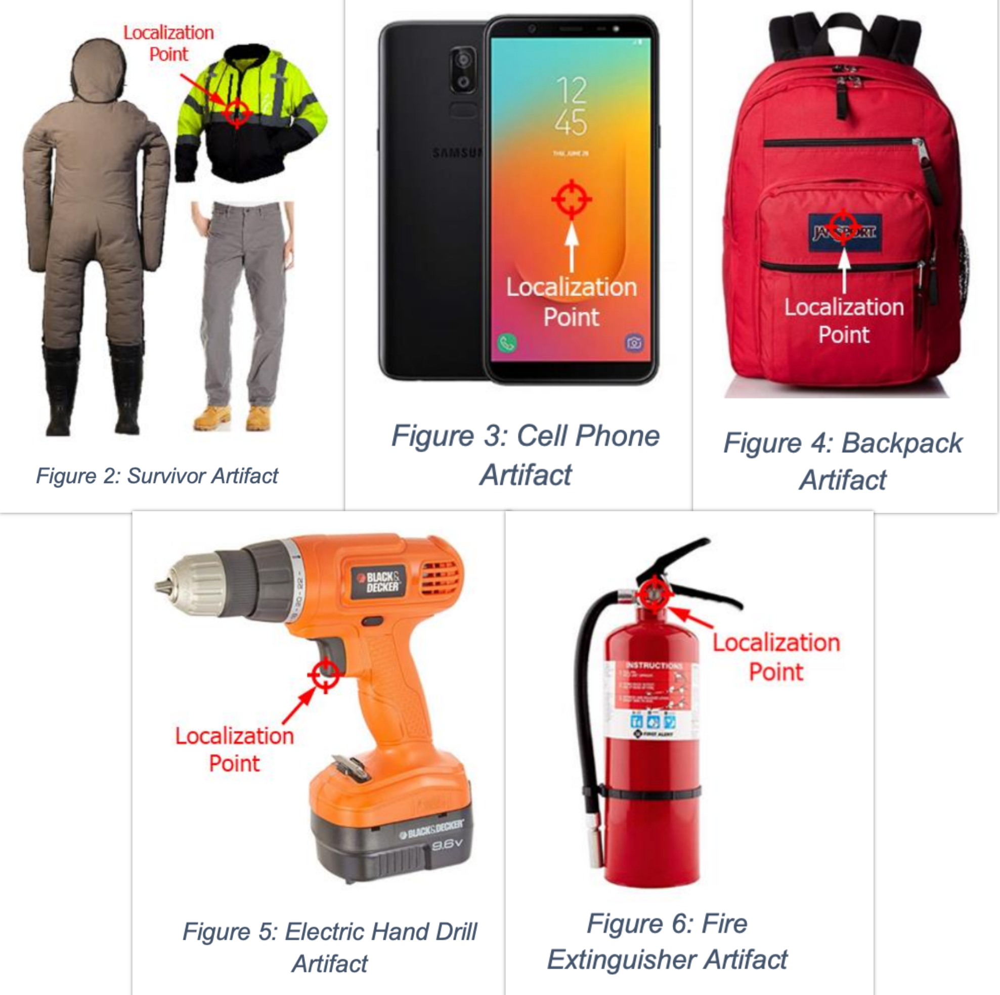
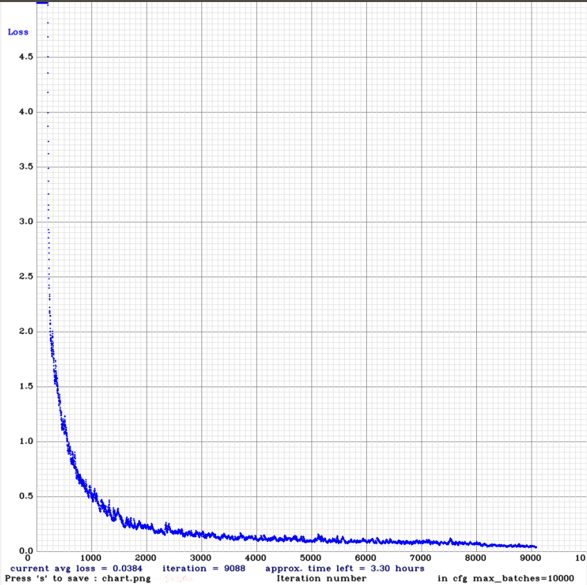
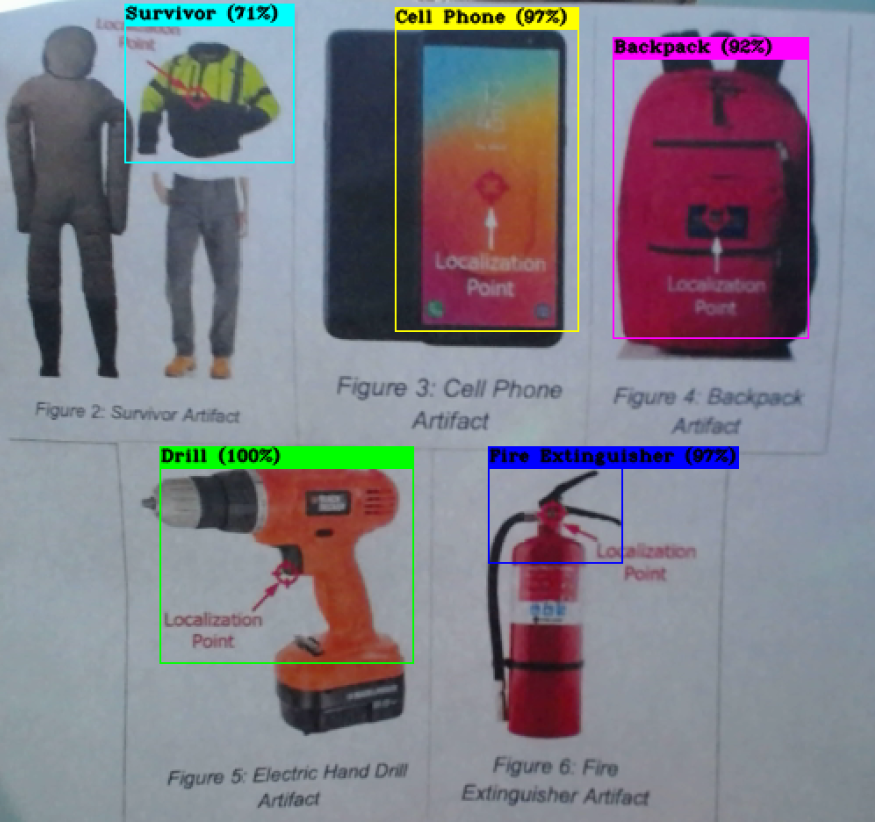

# SubT-Object-Detection
It's a repository for preserving Artifact detection model in order to detect object using YOLO v3 inside SubT simulator / real world SubT Environment.
## Artifact Classes:
No. of Artifact Classes: 5 <br>
Name of the Artifact Classes: Backpack, Survivor, Cell Phone, Fire Extinguisher, Drill.
## Artifact Localization Points:
<p align="center">
    
</p>

## Training Data:
Training & Validation Dataset (i.e `train` & `valid` folder) with proper labeling should be kept inside `~/darknet/data` directory. You can download the training and validation dataset from [here](https://drive.google.com/drive/folders/1vJiqT4SQExbuHGb6kJoW2MeFRDpF8kJq?usp=sharing). Download pre-trained weight file for convolutional layer from [darknet53.conv.74](https://pjreddie.com/media/files/darknet53.conv.74) & keep it inside `~/darknet` directory. 
## Training Demo:
```
cd ~/darknet
./build-release/darknet detector train data/train.data cfg/yolov3_train.cfg darknet53.conv.74
```
## Training Loss Curve:
<p align="center">
    
</p>

## Download Weight File:
The default weight file will be saved after every 1000 iterations inside `~/darknet/backup` directory during training. You can use your own weight file or you can use mine. In my case, I have trained for around 9000 iterations. It took around 26 hours for training purpose. You can download the weight file from [here](https://drive.google.com/drive/folders/1vJiqT4SQExbuHGb6kJoW2MeFRDpF8kJq?usp=sharing).  
## Testing Demo:
```
cd ~/darknet
./build-release/darknet detector demo data/train.data cfg/yolov3_test.cfg backup/yolov3_train_9000.weights -c 0
```
## Testing Result:
<p align="center">
    
</p>

## Resources Used During Training & Testing:
The data were trained inside Ubuntu 18.04 with Nvidia Graphics GTX 1070, Driver version 440.82 & CUDA version 10.2. I took around 300 images for each class totalling to 1500 images of which 1350 (90%) images were used as training dataset & 150 images (10%) were used as validation dataset. The testing was done with a logitech webcam and the detection frame rate was 15 fps.  

## SubT Simulator Implementation:
For better resolution video, see [here](https://www.youtube.com/watch?v=IBYRoKQEbYs).
<p align="center">
    
</p>

## Image Copyright: 
The images used in this work during training are taken from the internet. Respective people can claim copyright for the images.     
